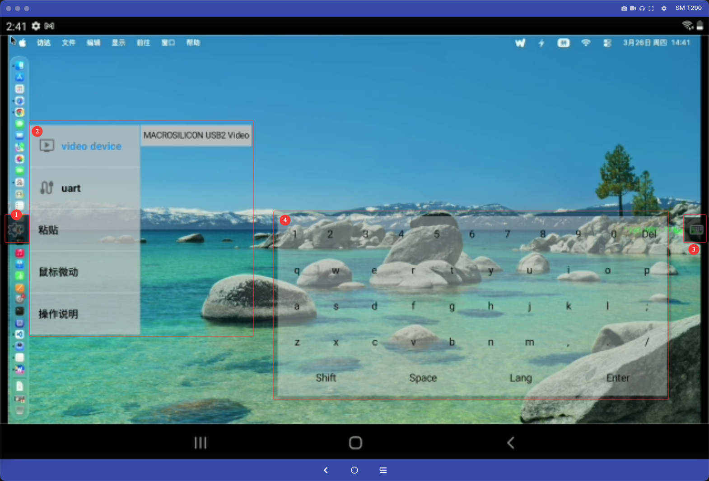
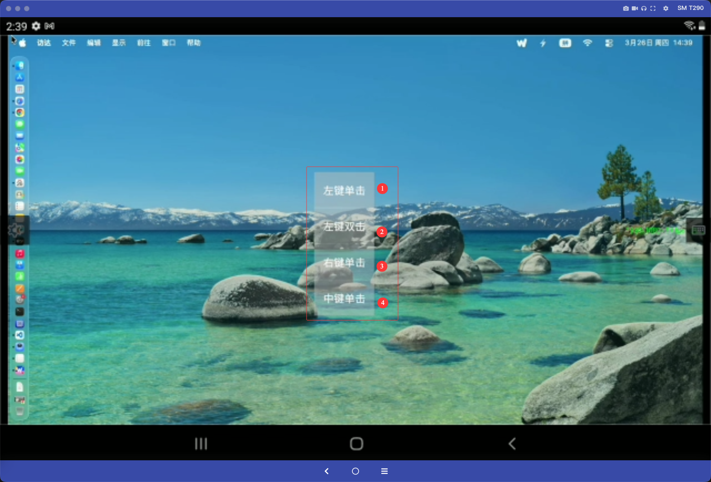

# 简介
配合 usb kvm，让安卓手机，平板变能操控 nas，视频开发板，服务器，机器人主板等。便捷方便。

## 功能原理
自动检测设备插入的 usb camera（UVC device）和 CDC uart。通过应用的界面实现全屏显示对目标设备的操控

## 主界面

1. 设置按钮
2. 设置菜单
3. 软键盘按钮
4. 软键盘

1. 鼠标左键单击
2. 鼠标左键双击
3. 鼠标右键单击
4. 鼠标中键单击
   
## 注意
请尽量保证安卓手机，pad 支持 usb3.0, 使用合格的 USB3.0 线缆，避免自动降速为 usb2.0 camera

## 操作说明
因为平板的触摸交互和 pc 的鼠标交互是不对等的，所以我们做了响应的设计和交互补充。以下说明 pc 中的鼠标行为在 app 中是如何对应的：

|pc 鼠标行为|app 行为|
|------|----------------|
｜move｜单击|
｜左键单击｜1）双击; 2）长按菜单操作|
｜左键双击｜长按菜单操作|
｜右键单击｜长按菜单操作|
｜中键单击｜长按菜单操作|
｜中键滚轮上下滑｜触摸上下滑动|

## 运行要求
安卓 11 及以上 平板和手机

## 开发环境

以下为当前仓库内 **已固定或可推导** 的版本；Android Studio 未在仓库中锁定，请按与 **Android Gradle Plugin** 官方要求选用 IDE。

| 类别 | 版本 / 说明 |
|------|----------------|
| **Android Studio** | 建议使用与 **AGP 8.0.x** 兼容的版本，例如 **Flamingo (2022.2.1)** 或更高；需满足 AGP 对 **JDK 17** 的要求（见下方）。 |
| **JDK** | **17**（Android Gradle Plugin 8.0.x 构建所需） |
| **Android Gradle Plugin (AGP)** | **8.0.2**（根目录 `build.gradle`） |
| **Gradle** | **8.4**（`gradle/wrapper/gradle-wrapper.properties`） |
| **Kotlin** | **1.8.20**（根目录 `build.gradle`） |
| **compileSdk** | **29** |
| **targetSdk** | **27** |
| **minSdk** | **19** |
| **NDK** | **29.0.14206865**（根目录 `ext.ndkVersion`；`local.properties` 可配置 `ndk.dir`） |
| **USB 串口（Java）** | **usb-serial-for-android** `3.8.0`（`com.github.mik3y:usb-serial-for-android`，见 `app/build.gradle`） |
| **UVC / JNI 栈（libuvc 模块）** | 随工程内置源码构建：**libusb** **1.0.19**（`libuvc/.../libusb/libusb/version.h`）、**libuvc** **0.0.4**（`libuvc_config.h`）、**libjpeg-turbo** **1.5.0**（`libuvc/src/main/jni/libjpeg-turbo-1.5.0`） |
| **Camera 封装** | 本地模块 **libausbc**（依赖 **libuvc**、**libnative**） |

构建前请安装 **Android SDK**、**NDK**（版本与上表一致或兼容），并在 `local.properties` 中配置 `sdk.dir`（及按需 `ndk.dir`）。
